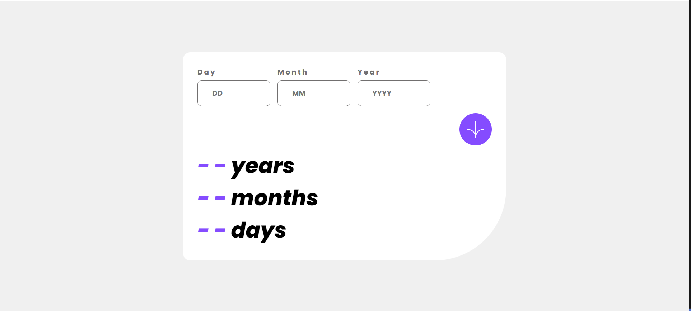

# Frontend Mentor - Age calculator app solution
  
## Overview

### The challenge

Users should be able to:

- View an age in years, months, and days after submitting a valid date through the form
- Receive validation errors if:
  - Any field is empty when the form is submitted
  - The day number is not between 1-31
  - The month number is not between 1-12
  - The year is in the future
  - The date is invalid e.g. 31/04/1991 (there are 30 days in April)
- View the optimal layout for the interface depending on their device's screen size
- See hover and focus states for all interactive elements on the page

### Screenshot

 

### Links

- Solution URL: [Github](https://github.com/Shahzaib-ur-Rehman/age-calculator-app)
- Live Site URL: [agr-calculator-app](https://age-calculator-app-ten-pied.vercel.app/)

## My process

### Built with

- Semantic HTML5 markup
- CSS custom properties
- Flexbox
- CSS Grid
- Mobile-first workflow
- [React](https://reactjs.org/) - JS library 

## Author

- Website - [Shahzaib ur Rehman](https://www.linkedin.com/in/shahzaib-ur-rehman-2518b01b8/)
- Frontend Mentor - [@Shahzaib-ur-Rehman](https://www.frontendmentor.io/profile/Shahzaib-ur-Rehman)
 